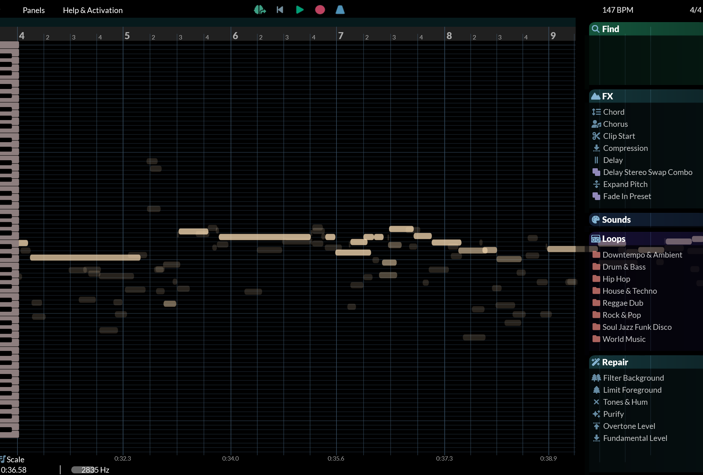
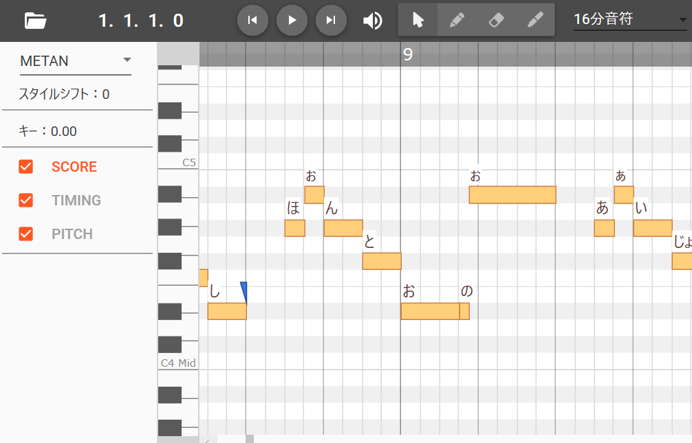
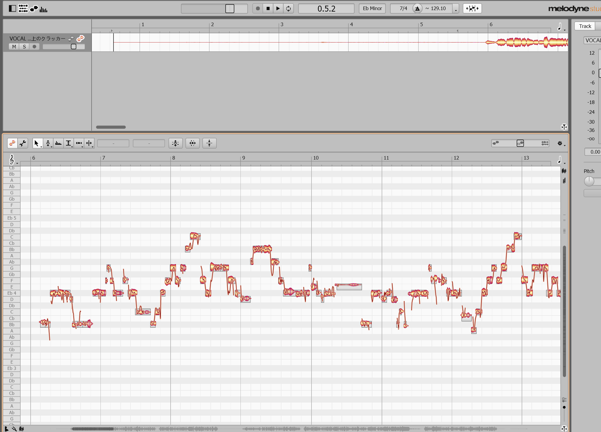

在这篇文章中，我将分享作为一个不会乐理唱歌跑调的人从零开始制作一个 Synthesizer V 翻唱视频的流程。

## 契机

2024 年 10 月，我第一次用 Neutrino 的四国めたん声库完成了一首经典 VOCALOID 歌曲的翻唱： [『Freely Tomorrow』 四国玫碳/四国めたん Cover 【Mitchie M】](https://www.bilibili.com/video/BV1kZ18YyEdw)，这次尝试让我更加深入地感受到 Mitchie M 这类 “拟人派” 术力口 P 的魅力——他们赋予电子歌声以灵魂；相比之下，使用 UTAU 或旧版 VOCALOID 以机械音凸显风格的作品虽然也有独特魅力，但并没有特别打动我。

从那之后，我对 AI 时代的虚拟歌手越来越感兴趣。然而，我并没有继续使用 Neutrino。虽然它是一个平民友好的免费开源软件，后端是由炫酷的 Rust 编写，并且支持 VOICEVOX 的人气角色声库，但其功能较为单一，歌声渲染速度也慢到怀疑没有用我的 GPU，甚至连官方 GUI 都没有。这么多年究竟是如何吸引用户的……？

在研究了几款同类 AI 歌声合成软件后，我最终选择了 **Synthesizer V**，其优缺点就是 Neutrino 反过来 。以下是我参考过的一些资料：

- [Synthesizer V Wiki](https://synthv.fandom.com/wiki/SynthV_Wiki) ：包含其发展历史和相关信息。
- 音乐制作人来兎对几款 AI 虚拟歌手软件的对比：[AIボーカルアプリ4種比較！Anknown Actorを歌わせてみた - YouTube](https://www.youtube.com/watch?v=dtUxjmD_9ik)

此外，一些直击我灵魂、让我燃起制作 Synthesizer V Cover 决心的作品，也值得一提：

1. [【宮舞モカ】フォニイ【SynthV カバー】 - ニコニコ動画](https://www.nicovideo.jp/watch/sm44188092) —— ツミキ原作的超人气术曲《Phony》的巅峰翻唱，个人认为比原唱还要震撼百倍。这是我第一次被宮舞モカ那如 Ado 般充满冲击力的嗓音所震撼，歌词「この世で造花より綺麗な花は無いわ」（" 这个世界上，没有比假花更美的花 "）更是让人信服。
2. [【小春六花】YOASOBI / 祝福 を歌ってもらった【機動戦士ガンダム 水星の魔女】【Synthesizer V AI】 - ニコニコ動画](https://www.nicovideo.jp/watch/sm41362443) —— 2022 年，使用小春六花音源翻唱当红炸子鸡歌手 YOASOBI 的高达主题曲，声音清澈且富含感情。
3. [ダーリンダーリン / めろくる feat. 夏色花梨 - ニコニコ動画](https://www.nicovideo.jp/watch/sm44350761)—— めろくる制作的原创曲，甜美可爱的风格完美展现了夏色花梨的特色，加上 MV 立绘与精美的视频制作，让花梨前辈的“甜蜜女友感”更上一层楼。

当然提到 Synthesizer V，就不得不顺带一提 2023 年重音テト的加入。自那以后，许多点击量爆表的テト原创歌曲和新老翻唱如井喷般涌现。

然后放上我的两部成品，都是人气艺术家ずっと真夜中でいいのに。的爆款，后面会围绕它们讲解制作流程。

- [脳裏上のクラッカー - 宮舞モカ (Synthesizer V AI翻唱)\_哔哩哔哩_bilibili](https://www.bilibili.com/video/BV1u8wme1Egt/)
- [嘘じゃない / ずっと真夜中でいいのに。 feat. 宮舞モカ_哔哩哔哩_bilibili](https://www.bilibili.com/video/BV1sXf2YcEou/)

## 准备工作

Without further ado，从一节开始将介绍如何从一无所有，到像八爪鱼一样操控多个软件和工具，最终制作出你想要的日语流行音乐翻唱。

### 软件

这里使用的是 Synthesizer V Studio Pro，虽然 Synthesizer V Studio 也有免费版但是功能限制太多。


此外，你还需要一款 **数字音频工作站（DAW）**，俗称“宿主”软件。它的作用是承载各类音轨文件，并支持各种效果器插件。不过，除非在 Synthesizer V 歌唱文件制作结束后，你认为不需要额外的混音等处理，使用内置功能合并音频即可的话，也可以不使用 DAW。我使用的是 **Studio One**，此外也有 FL Studio, Ableton Live, Adobe Audition 等不错的选择。我选择 DAW 的标准主要是界面直观、操作简单、教程丰富。

值得一提的是，Synthesizer V Pro 版附带 VST / AU / AAX 插件，因此可以在支持 VST 乐器的 DAW 里直接运行 Synthesizer V Studio。不过，我个人没有使用这个插件功能，具体详情可参考官方文档：[01 使用插件与 DAW 集成协作 \| Synthesizer V Studio User Manual](https://svdocs.dreamtonics.com/zh/synthv/plugins/instrument)。

除了这两个软件，后续章节还会提到我使用的其他软件以及混音插件。

### 选曲

当然是选你最喜欢的。我也考虑过从知名度较高的作品入手，好处在于特有名的音乐的相关资源，尤其是 MIDI 会非常好找。但是制作 Cover 其实是一个分享自己小众品味的绝佳机会，这也是我最大的动力之一。而且，太火的歌曲的翻唱大概率已经有人做过了，未必能有新意也不一定打得过人家。还有值得一提的是，我想制作女声翻唱，所以我认为原版最好也是女声或者音高较高的男声歌曲，否则可能需要升 Key；反之，若制作男声翻唱，则尽量选择音高较低的原曲。

### 选人

当然还是选你最喜欢的，但选择认知度较高的声库可能会更有优势。

就人气而言，Synthesizer V 里最火的声库大概是 31 岁奇美拉——重音テト。不过，我是没有特别喜欢 Teto 的异类。除此之外，比较受欢迎的声库还包括：宮舞モカ、小春六花、夏色花梨、花隈千冬，以及来自 BanG Dream! 的几位，可以在购买页面确认所有的声库：[Synthesizer V｜製品情報｜AHS(AH-Software)](https://www.ah-soft.com/synth-v/index.html)

另外还有一些注意事项包括：

- 需要是 AI 音源：一些较老的声库可能不支持 AI 功能，购买前务必确认。如果不是 AI 音源则不在本文讨论范围内。
- 确认角色参数：包括支持的语种和适用音域。这些信息可以通过产品说明或其他资料。
  - 有意思的关联视频： [【夏色花梨】SV最强ai高音歌姬的高音厨音域测试\_哔哩哔哩\_bilibili](https://www.bilibili.com/video/BV1CT4y1h7Qx/)
- 风格匹配：例如，如果你的选曲风格偏酷、偏有力，那么夏色花梨这种可爱系声库可能会增加调音难度，反之亦然。
- 预算：宰猪软件，Pro 本体价格约一万多日元个声库也在九千多日元，购买前了解清楚、深思熟虑，家里有矿另当别论。

### 获得音符

获取音符的方法有很多种，但没有哪一种是绝对最好的，选择取决于具体情况。

#### 现成的工程文件或者 MIDI 文件

最事半功倍的选择。这里的工程文件指的是 Synthesizer V 的 `.svp` 文件，也包括 UTAU、VOCALOID 等其他歌声合成软件的工程文件。鉴于术力口圈不像我们开源社区，资源可能不太容易找到。

找 MIDI 文件也是可以的，感觉术曲的 MIDI 会相对好找。一些乐谱分享网站（如 MuseScore）通常会提供 MIDI，但很多是付费资源，而且要注意 MIDI 是否包含主旋律音轨（Vocal），否则可能只是伴奏部分。以下是一些可以帮你获取资源的网站：

- [YAMAHA MUSIC DATA SHOP](https://yamahamusicdata.jp/) - YAMAHA 官方乐谱店铺，日本流行音乐曲库非常全，平均每个 MIDI 文件 400 日元还算可以，而且文件内包含所有的乐器与和声轨道。问题在于，这个网站上下载的 `.mid` 文件是受保护的“假 MIDI 文件”，只能使用官方的 [MidRadio](https://download.music-eclub.com/midradio/download.html) 软件播放，而且该软件不支持任何形式的转换或导出，所以如果没能力听音和转录的话，需要使用 Audacity 等软件将其录音后得到 WAV 然后再进行处理。
- [MidiShow - Share and Download MIDI files](https://www.midishow.com/) - 中文圈 MIDI 分享论坛，下载 MIDI 文件需要积分，积分可以通过论坛互动和付费获取。
- [UtaFormatix](https://sdercolin.github.io/utaformatix3/) - 一个可以在不同歌声合成软件的工程文件之间进行相互转换的 Web 应用，适合已经拥有例如 UTA 文件的情况。

#### 歌声转 MIDI 功能

如果没有现成的 MIDI 文件，Synthesizer V Studio Pro 提供了**歌声转 MIDI** 功能，可从音频中提取音高和歌词，并自动转换为音符。

此外，RipX DAW 和 Melodyne 也提供类似的音频转 MIDI 功能，可以从音频中提取旋律。但如果音源不是纯净的人声，转换效果可能会大打折扣。因此，如果没有干声（纯人声音乐 acapella），这一选项约等于手动扒谱。

后续将详细讲解我是如何从一整首歌曲中最终获得完整的音符数据。

#### 找人扒谱

淘宝等平台上有相关的服务，甚至有明说是可以帮你扒谱制作术力口音乐的扒谱服务。不过，这类服务通常价格不透明，有些扒谱师还要求署名，因此我没有实际联系过任何商家，仅作参考。

### 获得伴奏

这个容易，通常有以下几种方法：

- 官方伴奏：流行音乐专辑通常会附带 Instrumental 版本。
- [piapro(ピアプロ)](https://piapro.jp/) ：一个日语原创音乐共享平台，上面可以找到许多艺术家本人发布的 J-POP 和术曲的伴奏。
- 视频网站资源：YouTube、ニコニコ等，有时候能找到其他用户分享的伴奏版本。
- 如果你的歌实在是太小众，还可以用 AI 去除人声。
- 如果你科班出身，可以自己演奏或者编排电子乐器来制作伴奏，不过估计你也不会来读这篇文章。

## 开工

在本节中，我将示范如何从**仅有完整音乐文件及其伴奏文件**的情况下，逐步制作出完整的翻唱作品。达成这个初始条件非常简单，只要你拥有相应的专辑，一般都会包含这两种音频文件。

### 获取纯人声音频文件

目前市面上有许多基于 AI 的工具可以帮你从一个音频文件里面分离人声和伴奏。下面分享几个：

- [分离人声 \[AI\]](https://vocalremover.org/)
  - ✅ **特点**：完全免费，操作简单。
  - ✅ **使用方式**：直接上传完整音乐文件，即可自动分离出背景音乐和人声。
  - ⚠️ **限制**：每日使用额度有限，因此在分离前请确保选择了合适的音源。
- [Vocal Remover &amp; Instrumental AI Splitter \| LALAL.AI](https://www.lalal.ai/)
  - ✅ **特点**：支持分离**主旋律、和声（Backing Vocals）**，甚至乐器分轨。
  - ✅ **适用场景**：如果想为作品添加多声部但是自己没有办法把和声的乐谱扒出来的话，那这个功能可能对你来说非常有用。
  - ⚠️ **限制**：按次计价而且价格较高。
- [RipX DAW - The AI DAW](https://hitnmix.com/)
  - ✅ **特点**：桌面端软件，可将音乐文件拆分成**人声、钢琴、吉他等多个音轨**，并提供音高可视化界面而且还会用颜色深浅来标记它们的分贝强弱。
  - ✅ **优势**：可以分析和声、标记音符音阶，同时支持噪声过滤等声音编辑功能，虽然这些功能我没有用的很明白。
  - ⚠️ **限制**：**付费软件**，但新注册用户可获得一个为期 21 天的激活码。



使用以上任意一款工具，你都可以获得相对干净的纯人声音频文件。

### 从纯人声音频文件或 MIDI 文件新建工程

打开 Synthesizer V Studio，在拖拽你的文件之前，先调整节拍数（BPM）和小节数，不过绝大多数场合，默认的 4/4 拍无需更改。如果是 MIDI 文件的话可以先导入进去看看 BPM 有没有从 120 变成其他的数字，如果没有的话，很大概率说明你的文件里面没有相应的元信息。若你不确定选曲的 BPM，上面提到的工具都会显示所上传的音乐的原始 BPM。此外还有很多网站去供你查询，例如：[Find the BPM and key for any song \| Every song, every tempo \| SongBPM \| songbpm.com](https://songbpm.com/)。

把音频文件拖入到工程之后，按照 [09 歌声转 MIDI | Synthesizer V Studio User Manual](https://svdocs.dreamtonics.com/zh/synthv/advanced-usage/voice-to-midi) 操作就可以获得人声的音符了，音符的导出位置是当前选中的人声音轨，也就是说如果你当前选择的音轨已经有了一些音符的话，这时候你再进行导入，新旧音符可能会覆盖到一起。

当你获得歌声转 MIDI 之后的音符，并且使用了内置的填写歌词功能，虽然还是会有很多问题但大部分工作已经完成了，因为音符时间点通常是准确的，偶尔音高会给出错误的结果。

### 校准音轨

这一部分的目标是让人声和伴奏完美对齐，避免出现错拍或不协调的情况。因为纯人声是从完整音乐文件提取的，因此理论上两者的时间轴应该一致。接下来手动校准伴奏：

- 保持完整音乐的时间轴不动，让它从零秒开始。
- 按住 Shift 并向上滑动鼠标滚轮来放大时间轴，既让波形显示更清楚又可以做出更细致的调整。
- 移动伴奏音轨，使其与完整音乐的纯伴奏的部分的波形尽量对齐。
- 播放试听然后再去微调。

校准完成之后就可以选择删除或者静音掉那个完整音乐文件的音轨了。

### 修正音符与填写歌词

即使使用的是现成的 MIDI 文件，仍然可能需要进行一定的调整。当前的音符文件可能会存在几个常见问题：

- 音高异常，常见的情况是低了一个八度
- 歌词错误、不完整或发音时机不对
- 同一个部分的歌词之间不连续，甚至会有前一个音吞了下一个音的起始部分的现象

#### しゃくり（滑音修饰）

让歌声更加自然流畅的秘诀之一在于**「しゃくり」**（shakuri），即日语歌唱中的一种常见技巧。简单来说，这类似于“滑音”或“拖音”，让音符之间衔接得更自然，而不是生硬地跳转到下一个音符。



具体操作上，可以参考我曾在 Neutrino 里调整《Freely Tomorrow》的例子。歌词「ほんどう (这里按お发音) の」中的「お」与「の」，唱完「お」之后，原本应该在它结束后直接转入「の」，但为了增加自然感，需要在「お」结束后，保留一小部分「の」的音符与「う」相同的音高，然后再过渡到「の」的目标音高。可以通过手动拆分「の」，将比如第一个 32 分音符长度的部分保持在「う」的音高，并将后续的音符标记为「ぉ」，然后试听并调整这一小段的时长，直到达到自然流畅的效果。

这个调整方法类似于给旋律增加一点“顶针”修饰，让它在音高变化时更加细腻自然。

#### 使用 Melodyne 精确修正音符

因为这篇文章主要还是面向不会自己扒谱的同学，所以这里要介绍另一款工具叫 Melodyne。这款专业的音高编辑工具主要用于修正录音棚录制的人声，但在 Synthesizer V 的翻唱制作中，它的作用是分析旋律，帮助我们精准调整音符。即使没有这一款软件的话，上面提到的 RipX DAW 或者任意一款可以分析音高工具都是可以的。



这里继续以 Melodyne 为例子。首先打开 Melodyne 并导入人声 WAV 文件。软件会自动分析音符信息，但请务必确认算法设置为 “Melodic”，如果不是的话，请从菜单栏的 Algorithm 选项切换到这个算法，因为除了这个算法，其他的算法都是来分析多个声道的音乐文件使用的。

在音频文件转换完成之后，你就会看到如图所示的图形——以时间为横轴、音阶为纵轴的音符图形，和 Synthesizer V Studio 非常类似所以基本就可以照着这个来修正你的音符。额外补充的是，首先包络的粗细表示了音量的大小，其次在包络之间你还可以看见曲线，这是真正表示音阶的实时位置的图形，灰色方块只是大致量化了这些曲线，因此偶尔会有误导性，有时候和声很明显的部分这些灰色方块也会有误差。通常，灰色方块仅供参考，而真正的音高曲线才是最准确的。通过这些可视化信息，可以更精准地调整 Synthesizer V 里的音符，让它们更接近原曲的演唱方式。操作上的小技巧是按住一个包络你就可以听见这个时间点的音高。

#### 其它小贴士

为了让歌词更加连贯，建议在句子之间使用停顿符（cl）或呼吸符号（br），除非原唱在两句之间有明显停顿，否则尽量保证旋律的自然流畅。

在调整过程中，还可能遇到一个操作上的不便之处：音符通常不会自动对齐到小节的起始点上，这可能会导致拖动音符时，因吸附功能而跳到错误的位置。如果发生这种情况，可以选择隐藏小节线来进行操作，或者使用时间量化功能，不过后者我个人没有尝试过。

### 把前奏和高潮部分拆分成多个音轨

建议将主音轨按照歌曲结构拆分成不同部分，例如前奏、主歌、高潮等，拆分的原因主要有以下几点：

1. 不同部分可能需要不同的调音参数，例如主歌可能需要较柔和的音色，而高潮部分可能需要更有力的发声方式。
2. 在混音时更方便单独调整特定段落的音量或效果，确保不同部分之间的音量平衡。

### 导出成 WAV

如果工程文件只有单轨，则可以直接导出为立体声 WAV 文件。但在实际操作中，我通常会将主音轨拆分为多个部分，并且可能会添加和声轨，因此导出时，需要暂时删除掉和声轨，但注意不要保存工程，然后再勾选全部来完整导出主唱部分，再然后撤销删除轨道操作，最后单选和声轨继续导出。官方文档还有单独导出气声的说明，但是太高级了我没用过。最终，我们会得到主唱、和声等独立的音频文件，方便后续的混音处理。

### 混音

实质上这一节我们在做的是为贴唱混音。不过，即使没有运用真人声和真正的乐器伴奏，混音也是一个相当庞大的课题，不是我等非科班出身的凡夫俗子可以解释清楚的，因此这一节我只介绍大概怎么做，具体的混音技术请寻找专业的教程，网上也有专门为虚拟歌姬设计的教程甚至是混音插件预设分享。

简单来说这一部分就是把伴奏、导出的主音轨以及和声音轨（如果有的话）一并拖进 DAW 宿主软件。首先是再次对齐歌声和伴奏的轨道，然后就是往这两到三个轨道上拖放相应的效果器，伴奏的话往往声音会比较大所以可能会使用 EQ 去稍微压一下与人声冲突的部分，人声的话往往会使用 EQ、压缩器、去齿音效果器或者是任何现代的高级混音插件，反正我到这一步就是随便拉参数直到感觉凑合位置，最后总输出的电平可能会爆零，0db 是音乐里的天花板，响度超过 0 的部分是听不见的，所以往往会在总输出轨道上添加压限器。

首先，将伴奏、主音轨和和声音轨导入 DAW（如 Studio One, FL Studio 等），然后进行以下步骤：

- 把伴奏、导出的主音轨以及和声音轨（如果有的话）一并拖进 DAW 宿主软件。
- 调整轨道同步，确保人声与伴奏完全对齐。
- 对于伴奏，应用 EQ 适当削减伴奏中与人声冲突的频段，使人声更加突出。
- 对于人声：
  - 使用 EQ 消除大概 80-120Hz 以下的部分，并适当提高高音频域的响度。
  - 添加压缩器，Synthesizer V 导出的人声在高音时的响度会很高，低音的时候也会明显低于平均，所以有必要使这些在不同音量的区间都能保持清晰度。
  - 去齿音处理，减少“s”、“t”等高频齿音。
  - 可选添加混响或延迟，或者是使用现代的高级混音插件施加魔法。
- 最终音量超过 0dB 的话，需要在主输出轨道上添加限制器（Limiter），使用默认预设一般就可以。
  - 超过 0dB 又称爆零。在数字音频领域，0dBFS 是最大电平，超过后会导致削波失真，因此在混音过程中，通常会在总轨上添加 Limiter 以防止音量溢出。

混音完成后，导出为 FLAC 或 WAV 文件，即可进行最终发布。

### 制作视频

一般的 VOCALOID 系 MV 内容包括一图流、YMM4 的立绘 + 对口型、MMD 动画等。如果你像我一样不会编辑视频的话，除了一图流路线，另一个相对省事的办法是使用 AI 视频生成技术来为你的视频增色。

#### 一图流

如果是制作一图流视频，那么电脑上只需要安装 [FFmpeg](https://www.ffmpeg.org/download.html) 即可。将封面图片和导出的音频文件放到同一目录下，然后使用 PowerShell 打开该目录，执行以下命令：

```powershell
ffmpeg.exe -loop 1 -framerate 2 -i cover.png -i input.flac -vf scale=1920:1080 -c:v libx264 -crf 18 -pix_fmt yuv420p -c:a copy -shortest -ss 0 -t 270 output.mkv
```

- `-loop 1`
  - 让 `cover.png` 这张图片无限循环用作整个视频的背景画面。
- `-framerate 2`
  - 设置帧率为 2 FPS（每秒 2 帧）。因为是静态图片，帧率可以设得较低，以减少文件大小。
- `-i cover.png`
  - 指定输入图片 `cover.png` 作为视频帧源。
- `-i input.flac`
  - 指定输入音频文件 `input.flac`。注意如果你的视频格式是 MP4 而非 MKV 的话，是不能使用 FLAC 作为音频格式的。
- `-vf scale=1920:1080`
  - 使用 视频滤镜 (`-vf`) 将 `cover.png` 调整为 1920x1080 分辨率，确保它适应最终的视频大小。
- `-c:v libx264`
  - 使用 `libx264` 视频编码器，将图片转为 H.264 格式。
- `-crf 18`
  - 设置视频质量参数：
    - `CRF`（Constant Rate Factor）决定编码质量，值范围是 0-51，18 表示接近无损，但仍有较好的压缩效果（0 是无损，23 是默认值，51 是最差）。
- `-pix_fmt yuv420p`
  - 设定像素格式为 `yuv420p`，这是大多数播放器（尤其是硬件解码器）支持的标准格式。
- `-c:a copy`
  - 直接复制音频流，而不重新编码，保持音质无损。
- `-shortest`
  - 让输出视频的时长匹配最短的输入流，即音频长度，这样视频不会比音频长。
- `-ss 0`
  - 从音频的 0 秒处开始。
- `-t 270`
  - 限制视频长度为 270 秒（4 分 30 秒），即音频文件长度。
- `output.mkv`
  - 指定输出文件格式为 MKV。

#### 使用炫酷的 AI 视频生成技术

国内的快手可灵和 OpenAI 的 Sora 等都是当下流行的 AI 视频生成服务，即使生成的视频只有五秒到十秒，但仍然可以通过一些方式扩展成完整视频。例如可以生成多个视频然后把它们拼到一起，可以使用 RIFE 等 AI 插帧工具把一个短的视频拉伸成一个长的视频，或者是循环播放一个看起来可循环的视频。

把视频和音频贴在一起的示例命令：

```powershell
ffmpeg.exe -hwaccel cuda -i input.mkv -i input.flac -c:v h264_nvenc -preset fast -b:v 5M -c:a copy output.mkv
```

- `-hwaccel cuda`
  - 启用 NVIDIA CUDA 加速（如果支持）
- `-c:v h264_nvenc`
  - 使用 NVIDIA GPU 硬件编码 (`h264_nvenc`) 将处理后的视频编码成 H.264 格式
- `-preset fast`
  - 设置编码速度模式，此外还有 `slow` 和 `medium` 等选项，速度和质量成反比
- `-b:v 5M`
  - 设置视频比特率为 5Mbps
- `-c:a copy`
  - 直接复制音频流，不进行重新编码，避免音频劣化

### 投稿

投稿时的注意点包括：

- 在视频简介的时候添加上所有你使用到的素材的出处，例如你使用的伴奏如果是网上公开的话添加上链接，以及制作 MV 时使用的素材等。如果在 NICONICO 投稿，需要连结「親作品」。
- 添加标签提高曝光度。
- 上传成功之后添加相应的歌词字幕。我为我自己的两个视频都上传了中文和日语两个字幕，当然在视频制作的时候使用了内嵌字幕的话也是可以的。
- 分享给亲朋好友。
- Profit!
